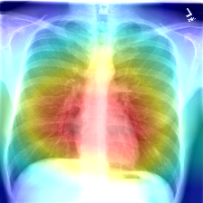
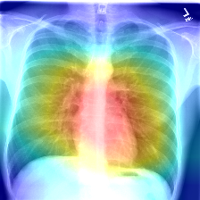

# Chest X-ray Classification  Using Deep Learning
 ( Ref. [CheXNet Github](https://github.com/zoogzog/chexnet) / [CheXNet Paper](https://stanfordmlgroup.github.io/projects/chexnet/) )

----
### ToDo List

~~1. TestSet 모두 Heatmap Image 생성~~
2. Preprocessing 에서 Resize하고 Crop 확인
~~3. Normalizer 확인~~
~~4. 3가지 Normalize 방법 마다 차이 확인~~
5. K-fold cross validation 적용
6. Categorical Training 적용
7. Other Network 적용
8. Transfer Learning 적용
9. Post Processing에서 Activation Map의 Threshold 변경

----
### 05-DEC-2019
* Train Loss 0.154
* Test Batch Size 16 
----
### 04-DEC-2019
* Image별 Normalize 적용 (0~1) -> Next Normalize (-1~1)
* Training :: Batch 192, Epoch 100, 33h 소요.
* 기존 Constant Value에서 각각의 연산이 추가되어 트레이닝 시간이 길어짐.
----

### 28-NOV-2019
 * Training :: Batch 128, Epoch 150으로 16h 소요.
 * ImageNet에서의 Pretraining 된 Network를 가져와서 적용.

<table>
<thead>
  <tr>
  <th align="center">Origin Image</th>
  <th align="center">Image of the model I trained</th>
  <th align="center">Image with CheXNet Model</th>
  </tr>
</thead>
<tbody>
    <tr>
        <td align="center">
        
        </td>
        <td align="center">
        
        </td>
        <td align="center">
        
        </td>  
    </tr>
  </tbody>
</table>

| Pathology     |AUROC (Mine)   | AUROC (CheXNet)|
| ------------- |:-------------:|:--------------:|
| Atelectasis   | 0.825         | 0.832          |
| Cardiomegaly  | 0.896         | 0.910          |
| Effusion      | 0.883         | 0.886          |
| Infiltration  | 0.707         | 0.714          |
| Mass          | 0.855         | 0.865          |
| Nodule        | 0.783         | 0.803          |
| Pneumonia     | 0.764         | 0.765          |
| Pneumothorax  | 0.872         | 0.885          |
| Consolidation | 0.812         | 0.815          |
| Edema         | 0.900         | 0.901          |
| Emphysema     | 0.932         | 0.942          |
| Fibrosis      | 0.851         | 0.852          |
| P.T.          | 0.783         | 0.794          |
| Hernia        | 0.930         | 0.941          |
| <b>Total AUROC  | <b>0.842    | <b>0.850       | 
----