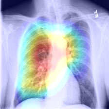
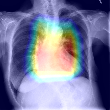
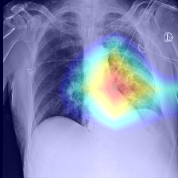
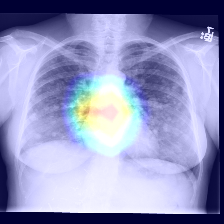

# Chest X-ray Classification  Using Deep Learning
 ( Ref. [CheXNet Github](https://github.com/zoogzog/chexnet) / [CheXNet Paper](https://stanfordmlgroup.github.io/projects/chexnet/) )

----
### ToDo List

5. K-fold cross validation 적용 
6. Categorical Training 적용 
7. Other Network 적용 
8. Transfer Learning 적용 
10. Normal / Cardiomegaly / Lung / Pleural Categorical Training (for Localization)  
~~1. TestSet 모두 Heatmap Image 생성~~ (Done) 
~~2. Preprocessing 에서 Resize하고 Crop 확인~~ (Done)  
~~3. Normalizer 확인~~ (Done) 
~~4. 3가지 Normalize 방법 마다 차이 확인~~ (Done) 
~~9. Post Processing에서 Activation Map의 Threshold 변경~~ (Done) 

----

### 10-DEC-2019
* <b>Threshold 0.5 Visualize (05-DEC-2019 Model)</b> 

<table>
  <thead>
  </thead>
<tbody>
    <tr>
        <th align="center">Normal</th>
        <th align="center"></th>
        <th align="center"></th>
        <th align="center"></th>
    </tr>
    <tr>
        <td align="center">
        
        </td>
        <td align="center">
        
        </td>
        <td align="center">
        
        </td>
        <td align="center">
        
        </td>   
    </tr>
    <tr>
        <th align="center">Atelectasis</th>
        <th align="center"></th>
        <th align="center"></th>
        <th align="center"></th>
    </tr>
    <tr>
        <td align="center">
        
        </td>
        <td align="center">
        
        </td>
        <td align="center">
        
        </td>
        <td align="center">
        
        </td>   
    </tr>
    <tr>
        <th align="center">Cardiomegaly</th>
        <th align="center"></th>
        <th align="center"></th>
        <th align="center"></th>
    </tr>
    <tr>
        <td align="center">
        
        </td>
        <td align="center">
        
        </td>
        <td align="center">
        
        </td>
        <td align="center">
        
        </td>  
    </tr>
    <tr>
        <th align="center">Effusion</th>
        <th align="center"></th>
        <th align="center"></th>
        <th align="center"></th>
    </tr>
    <tr>
        <td align="center">
        
        </td> 
        <td align="center">
        
        </td>
        <td align="center">
        
        </td>
        <td align="center">
        
        </td>
    </tr>
    <tr>
        <th align="center">Infiltration</th>
        <th align="center"></th>
        <th align="center"></th>
        <th align="center"></th>
    </tr>
    <tr>
        <td align="center">
        
        </td> 
        <td align="center">
        
        </td>
        <td align="center">
        
        </td>
        <td align="center">
        
        </td>
    </tr>
    <tr>
        <th align="center">Mass</th>
        <th align="center"></th>
        <th align="center"></th>
        <th align="center"></th>
    </tr>
    <tr>
        <td align="center">
        
        </td> 
        <td align="center">
        
        </td>
        <td align="center">
        
        </td>
        <td align="center">
        
        </td>
    </tr>
    <tr>
        <th align="center">Nodule</th>
        <th align="center"></th>
        <th align="center"></th>
        <th align="center"></th>
    </tr>
    <tr>
        <td align="center">
        
        </td> 
        <td align="center">
        
        </td>
        <td align="center">
        
        </td>
        <td align="center">
        
        </td>
    </tr>
    <tr>
        <th align="center">Pneumonia</th>
        <th align="center"></th>
        <th align="center"></th>
        <th align="center"></th>
    </tr>
    <tr>
        <td align="center">
        
        </td> 
        <td align="center">
        
        </td>
        <td align="center">
        
        </td>
        <td align="center">
        
        </td>
    </tr>
    <tr>
        <th align="center">Pneumothorax</th>
        <th align="center"></th>
        <th align="center"></th>
        <th align="center"></th>
    </tr>
    <tr>
        <td align="center">
        
        </td> 
        <td align="center">
        
        </td>
        <td align="center">
        
        </td>
        <td align="center">
        
        </td>
    </tr>
    <tr>
        <th align="center">Consolidation</th>
        <th align="center"></th>
        <th align="center"></th>
        <th align="center"></th>
    </tr>
    <tr>
        <td align="center">
        
        </td> 
        <td align="center">
        
        </td>
        <td align="center">
        
        </td>
        <td align="center">
        
        </td>
    </tr>
    <tr>
        <th align="center">Edema</th>
        <th align="center"></th>
        <th align="center"></th>
        <th align="center"></th>
    </tr>
    <tr>
        <td align="center">
        
        </td> 
        <td align="center">
        
        </td>
        <td align="center">
        
        </td>
        <td align="center">
        
        </td>
    </tr>
    <tr>
        <th align="center">Emphysema</th>
        <th align="center"></th>
        <th align="center"></th>
        <th align="center"></th>
    </tr>
    <tr>
        <td align="center">
        
        </td> 
        <td align="center">
        
        </td>
        <td align="center">
        
        </td>
        <td align="center">
        
        </td>
    </tr>
    <tr>
        <th align="center">Fibrosis</th>
        <th align="center"></th>
        <th align="center"></th>
        <th align="center"></th>
    </tr>
    <tr>
        <td align="center">
        
        </td> 
        <td align="center">
        
        </td>
        <td align="center">
        
        </td>
        <td align="center">
        
        </td>
    </tr>
    <tr>
        <th align="center">Pleural_Thickening</th>
        <th align="center"></th>
        <th align="center"></th>
        <th align="center"></th>
    </tr>
    <tr>
        <td align="center">
        
        </td> 
        <td align="center">
        
        </td>
        <td align="center">
        
        </td>
        <td align="center">
        
        </td>
    </tr>
    <tr>
        <th align="center">Hernia</th>
        <th align="center"></th>
        <th align="center"></th>
        <th align="center"></th>
    </tr>
    <tr>
        <td align="center">
        
        </td> 
        <td align="center">
        
        </td>
        <td align="center">
        
        </td>
        <td align="center">
        
        </td>
    </tr>
  </tbody>
</table>

* <b>Threshold 0.5 Visualize (Paper Model)</b> 

<table>
  <thead>
  </thead>
<tbody>
    <tr>
        <th align="center">Normal</th>
        <th align="center"></th>
        <th align="center"></th>
        <th align="center"></th>
    </tr>
    <tr>
        <td align="center">
        
        </td>
        <td align="center">
        
        </td>
        <td align="center">
        
        </td>
        <td align="center">
        
        </td>   
    </tr>
    <tr>
        <th align="center">Atelectasis</th>
        <th align="center"></th>
        <th align="center"></th>
        <th align="center"></th>
    </tr>
    <tr>
        <td align="center">
        
        </td>
        <td align="center">
        
        </td>
        <td align="center">
        
        </td>
        <td align="center">
        
        </td>   
    </tr>
    <tr>
        <th align="center">Cardiomegaly</th>
        <th align="center"></th>
        <th align="center"></th>
        <th align="center"></th>
    </tr>
    <tr>
        <td align="center">
        
        </td>
        <td align="center">
        
        </td>
        <td align="center">
        
        </td>
        <td align="center">
        
        </td>  
    </tr>
    <tr>
        <th align="center">Effusion</th>
        <th align="center"></th>
        <th align="center"></th>
        <th align="center"></th>
    </tr>
    <tr>
        <td align="center">
        
        </td> 
        <td align="center">
        
        </td>
        <td align="center">
        
        </td>
        <td align="center">
        
        </td>
    </tr>
    <tr>
        <th align="center">Infiltration</th>
        <th align="center"></th>
        <th align="center"></th>
        <th align="center"></th>
    </tr>
    <tr>
        <td align="center">
        
        </td> 
        <td align="center">
        
        </td>
        <td align="center">
        
        </td>
        <td align="center">
        
        </td>
    </tr>
    <tr>
        <th align="center">Mass</th>
        <th align="center"></th>
        <th align="center"></th>
        <th align="center"></th>
    </tr>
    <tr>
        <td align="center">
        
        </td> 
        <td align="center">
        
        </td>
        <td align="center">
        
        </td>
        <td align="center">
        
        </td>
    </tr>
    <tr>
        <th align="center">Nodule</th>
        <th align="center"></th>
        <th align="center"></th>
        <th align="center"></th>
    </tr>
    <tr>
        <td align="center">
        
        </td> 
        <td align="center">
        
        </td>
        <td align="center">
        
        </td>
        <td align="center">
        
        </td>
    </tr>
    <tr>
        <th align="center">Pneumonia</th>
        <th align="center"></th>
        <th align="center"></th>
        <th align="center"></th>
    </tr>
    <tr>
        <td align="center">
        
        </td> 
        <td align="center">
        
        </td>
        <td align="center">
        
        </td>
        <td align="center">
        
        </td>
    </tr>
    <tr>
        <th align="center">Pneumothorax</th>
        <th align="center"></th>
        <th align="center"></th>
        <th align="center"></th>
    </tr>
    <tr>
        <td align="center">
        
        </td> 
        <td align="center">
        
        </td>
        <td align="center">
        
        </td>
        <td align="center">
        
        </td>
    </tr>
    <tr>
        <th align="center">Consolidation</th>
        <th align="center"></th>
        <th align="center"></th>
        <th align="center"></th>
    </tr>
    <tr>
        <td align="center">
        
        </td> 
        <td align="center">
        
        </td>
        <td align="center">
        
        </td>
        <td align="center">
        
        </td>
    </tr>
    <tr>
        <th align="center">Edema</th>
        <th align="center"></th>
        <th align="center"></th>
        <th align="center"></th>
    </tr>
    <tr>
        <td align="center">
        
        </td> 
        <td align="center">
        
        </td>
        <td align="center">
        
        </td>
        <td align="center">
        
        </td>
    </tr>
    <tr>
        <th align="center">Emphysema</th>
        <th align="center"></th>
        <th align="center"></th>
        <th align="center"></th>
    </tr>
    <tr>
        <td align="center">
        
        </td> 
        <td align="center">
        
        </td>
        <td align="center">
        
        </td>
        <td align="center">
        
        </td>
    </tr>
    <tr>
        <th align="center">Fibrosis</th>
        <th align="center"></th>
        <th align="center"></th>
        <th align="center"></th>
    </tr>
    <tr>
        <td align="center">
        
        </td> 
        <td align="center">
        
        </td>
        <td align="center">
        
        </td>
        <td align="center">
        
        </td>
    </tr>
    <tr>
        <th align="center">Pleural_Thickening</th>
        <th align="center"></th>
        <th align="center"></th>
        <th align="center"></th>
    </tr>
    <tr>
        <td align="center">
        
        </td> 
        <td align="center">
        
        </td>
        <td align="center">
        
        </td>
        <td align="center">
        
        </td>
    </tr>
    <tr>
        <th align="center">Hernia</th>
        <th align="center"></th>
        <th align="center"></th>
        <th align="center"></th>
    </tr>
    <tr>
        <td align="center">
        
        </td> 
        <td align="center">
        
        </td>
        <td align="center">
        
        </td>
        <td align="center">
        
        </td>
    </tr>
  </tbody>
</table>

----

### 05-DEC-2019

* 0 To 1 :: Train Loss = 0.154 | Test Batch Size = 16
* -1 To 1 :: Train Loss = 0.149 | Test Batch Size = 16

<table>
  <thead>
    <tr>
    <th align="center">Normal</th>
    <th align="center">Atelectasis</th>
    <th align="center">Cardiomegaly</th>
    <th align="center">Effusion</th>
    </tr>
  </thead>
<tbody>
    <tr>
        <td align="center">
        
        </td>
        <td align="center">
        
        </td>
        <td align="center">
        
        </td>
        <td align="center">
        
        </td>   
    </tr>
    <tr>
        <th align="center">Infiltration</th>
        <th align="center">Mass</th>
        <th align="center">Nodule</th>
        <th align="center">Pneumonia</th>
    </tr>
    <tr>
        <td align="center">
        
        </td>
        <td align="center">
        
        </td>
        <td align="center">
        
        </td>
        <td align="center">
        
        </td>   
    </tr>
    <tr>
        <th align="center">Pneumothorax</th>
        <th align="center">Consolidation</th>
        <th align="center">Edema</th>
        <th align="center">Emphysema</th>
    </tr>
    <tr>
        <td align="center">
        
        </td>
        <td align="center">
        
        </td>
        <td align="center">
        
        </td>
        <td align="center">
        
        </td>  
    </tr>
    <tr>
        <th align="center">Fibrosis</th>
        <th align="center">Pleural_Thickening</th>
        <th align="center">Hernia</th>
    </tr>
    <tr>
        <td align="center">
        
        </td> 
        <td align="center">
        
        </td>
        <td align="center">
        
        </td>
    </tr>
  </tbody>
</table>

| Pathology     |AUROC  (CIFAR Norm)   | AUROC  (0 to 1 Norm)| AUROC  (-1 To 1 Norm)
| ------------- |:-------------:|:--------------:|:--------------:|
| Atelectasis   | 0.825         | 0.804          | 0.823          |
| Cardiomegaly  | 0.896         | 0.910          | 0.903          |
| Effusion      | 0.883         | 0.873          | 0.883          |
| Infiltration  | 0.707         | 0.702          | 0.709          |
| Mass          | 0.855         | 0.838          | 0.852          |
| Nodule        | 0.783         | 0.763          | 0.790          |
| Pneumonia     | 0.764         | 0.748          | 0.770          |
| Pneumothorax  | 0.872         | 0.855          | 0.878          |
| Consolidation | 0.812         | 0.800          | 0.816          |
| Edema         | 0.900         | 0.889          | 0.900          |
| Emphysema     | 0.932         | 0.899          | 0.931          |
| Fibrosis      | 0.851         | 0.809          | 0.840          |
| P.T.          | 0.783         | 0.767          | 0.789          |
| Hernia        | 0.930         | 0.942          | 0.938          |
| <b>Total AUROC  | <b>0.842    | <b>0.828       | <b>0.844       |
 

* Next Training ... Done
* Normalize -1 ~ 1 적용.
* Training :: Batch 256, Epoch 100
----
### 04-DEC-2019
* Image별 Normalize 적용 (0~1) -> Next Normalize (-1~1)
* Training :: Batch 192, Epoch 100, 33h 소요.
* 기존 Constant Value에서 각각의 연산이 추가되어 트레이닝 시간이 길어짐.
* Activation Map with Threshold
* Threshold 0.5 & 0.8 ( 50% & 80% )
<table>
<thead>
  <tr>
  <th align="center">Origin Image</th>
  <th align="center">Threshold 0.5</th>
  <th align="center">Threshold 0.8</th>
  </tr>
</thead>
<tbody>
    <tr>
        <td align="center">
        
        </td>
        <td align="center">
        
        </td>
        <td align="center">
        
        </td>  
    </tr>
  </tbody>
</table>

----

### 28-NOV-2019
 * Training :: Batch 128, Epoch 150으로 16h 소요.
 * ImageNet에서의 Pretraining 된 Network를 가져와서 적용.

<table>
<thead>
  <tr>
  <th align="center">Origin Image</th>
  <th align="center">Image of the model I trained</th>
  <th align="center">Image with CheXNet Model</th>
  </tr>
</thead>
<tbody>
    <tr>
        <td align="center">
        
        </td>
        <td align="center">
        
        </td>
        <td align="center">
        
        </td>  
    </tr>
  </tbody>
</table>

| Pathology     |AUROC (Mine)   | AUROC (CheXNet)|
| ------------- |:-------------:|:--------------:|
| Atelectasis   | 0.825         | 0.832          |
| Cardiomegaly  | 0.896         | 0.910          |
| Effusion      | 0.883         | 0.886          |
| Infiltration  | 0.707         | 0.714          |
| Mass          | 0.855         | 0.865          |
| Nodule        | 0.783         | 0.803          |
| Pneumonia     | 0.764         | 0.765          |
| Pneumothorax  | 0.872         | 0.885          |
| Consolidation | 0.812         | 0.815          |
| Edema         | 0.900         | 0.901          |
| Emphysema     | 0.932         | 0.942          |
| Fibrosis      | 0.851         | 0.852          |
| P.T.          | 0.783         | 0.794          |
| Hernia        | 0.930         | 0.941          |
| <b>Total AUROC  | <b>0.842    | <b>0.850       | 
----