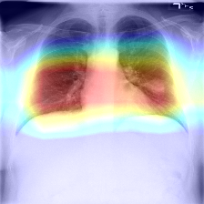
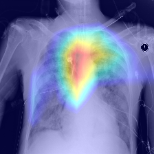
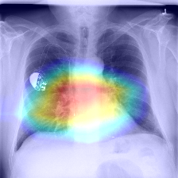
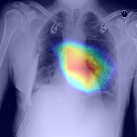

# Chest X-ray Classification  Using Deep Learning
 ( Ref. [CheXNet Github](https://github.com/zoogzog/chexnet) / [CheXNet Paper](https://stanfordmlgroup.github.io/projects/chexnet/) )

----
### ToDo List

05 - Apply K-fold cross validation. 
06 - Apply Categorical Training 
07 - Apply Other Network 
08 - Apply Transfer Learning 

~~01 - Generate heat map images for all test sets~~ (Done) 
~~02 - Resize and crop check during preprocessing~~ (Done)  
~~03 - Check Normalizer~~ (Done) 
~~04 - Check the differences between the three normalization methods.~~ (Done) 
~~09 - Change Threshold of Activation Map in Post Processing~~ (Done) 
~~10 - Apply Normal / Cardiomegaly / Lung / Pleural Categorical Training (for Localization)~~ (Done) 

----

### 23-DEC-2019

In the paper referred to, they selected one result output from the deep learning model. 
But the problem we have is in several labels. Since there are several diseases in one picture, We need to create a model with multiple outputs. To create a model with multiple outputs, we applied softmax instead of sigmoid in the last layer. The test result for the trained model is AUROC 0.767. We think the result is not good because the model has to infer multiple labels. This is a more difficult problem.  

Here are some questions to solve.
- In category training, the final results cannot exceed the accuracy of the first model, so consider how the first layer should be constructed.
- Consider which of the several probability values should be selected as the correct answer.
- We need to think about the problem of imbalance in datasets and how we should communicate our trained results with the MD.

----

### 18-DEC-2019
#### Analysis of two heatmaps.

There are two heatmaps created by models made from categorical training. Both heatmap are about Cardiomegaly, but the parts shown are different. It was confusing because one model drew a different heatmap for the same disease. At first, we thought our model was a badly trained model. However after repeated training, we found the same result. If the model was well-trained, We thought about how to interpret the results.

 
<table>
  <thead></thead>
<tbody>
    <tr>
        <th align="center">Cardiomegaly - 1</th>
        <th align="center">Cardiomegaly - 2</th>
    </tr>
    <tr>
        <td align="center">
        
        </td>
        <td align="center">
        
        </td> 
    </tr>
</tbody>
</table> 
 

In conclusion We recognise that the two heatmaps show the same thing in different ways. Cardiomegaly is determined by comparing the size of the heart and the distance between both lungs in x-ray. The first heatmap shows the length of the left and right lungs being abnormal compared to the size of the heart. The second heatmap is the same judgment based on the heart area.   
In order to conduct more tests on the model, it plans to preprocess and insert other data sets. We will apply transfer learning by training only each disease and normal data to increase the accuracy of the model.

----
### 16-DEC-2019
#### Categorical Training Analysis with Normal Label.

The training shows the same results as before. Herina and Cardiomegaly with a small number of data show good AUROC.

|               |     AUROC     | #Labels   |
| ------------- |:-------------:|:---------:|
| Lung          | 0.746         | 29,300    |
| Cardiomegaly  | <b>0.914      | <b>1,950  |
| Pleural       | 0.851         | 13,805    |
| Herina        | <b>0.948      | <b>144    |
| Normal        | <b>0.787      | <b>42,405 |
| <b>Total      | <b>0.849      |           |

Lung seems to have low AUROC because various diseases are grouped into one category. There is an imbalance in the number of data, but the results are consistent. Even before applying category training, Cardiomegaly and Herina's AUROC was good and We think it's a more distinctive group than other categories.

----
### 12-DEC-2019
#### Categorical Training Analysis

In training, the loss value decreased very slowly compared to the previous training.
We thought it was harder to find special features because multiple images were labeled in one image and the number of categories was reduced.
The results of running the test data with the model obtained from the categorical training are as below.  

|               |     AUROC     | #Labels  |
| ------------- |:-------------:|:--------:|
| Lung          | 0.746         | 29,300   |
| Cardiomegaly  | <b>0.914      | <b>1,950 |
| Pleural       | 0.852         | 13,805   |
| Herina        | <b>0.926      | <b>144   |
| <b>Total      | <b>0.860      |          |

  There are a few things to think about in results. The AUROC value means that a good model has been created that categorizes four categories well. However, if you look at the categories Herina and Cardiomegaly, which have the best results, they have the fewest datasets. In general, the number of data and the result are inversely proportional. The results were confusing. So we decided to train the model again, this time We added 'Normal' to the label, creating a total of five categories. 

|               | #Labels   |
| ------------- |:---------:|
| Lung          | 29,300    |
| Cardiomegaly  | 1,950     |
| Pleural       | 13,805    |
| Herina        | 144       |
| <b>Normal     | <b>42,405 |

 We know that the number of data is unbalanced. Based on the results of this training, we plan to find improvements.

----
### 11-DEC-2019
#### <b>Apply Categorical Training</b> 

In a previous study, we recognized that our model's Actication map is very wide. This means that the localization of our model is not good. So this time we use categorical training. The label for this approach is divided into below.  

| Pathology     | Lung          | Cardiomegaly   | Pleural      | Herina    |
| ------------- |:-------------:|:--------------:|:------------:|:---------:|
| Atelectasis   | 1             | 0              | 0            | 0         |
| Cardiomegaly  | 0             | 1              | 0            | 0         |
| Effusion      | 0             | 0              | 1            | 0         |
| Infiltration  | 1             | 0              | 0            | 0         |
| Mass          | 1             | 0              | 0            | 0         |
| Nodule        | 1             | 0              | 0            | 0         |
| Pneumonia     | 1             | 0              | 0            | 0         |
| Pneumothorax  | 0             | 0              | 1            | 0         |
| Consolidation | 1             | 0              | 0            | 0         |
| Edema         | 1             | 0              | 0            | 0         |
| Emphysema     | 1             | 0              | 0            | 0         |
| Fibrosis      | 1             | 0              | 0            | 0         |
| P.T.          | 0             | 0              | 1            | 0         |
| Hernia        | 0             | 0              | 0            | 1         |

 Because the number of labels has decreased, we expect the AUROC value to be slightly higher. Based on the results, we plan to apply another disease-categorical training.

----

### 10-DEC-2019
#### <b>Threshold 0.5 Visualize (05-DEC-2019 Model)</b> 

<table>
  <thead>
  </thead>
<tbody>
    <tr>
        <th align="center">Normal</th>
        <th align="center"></th>
        <th align="center"></th>
        <th align="center"></th>
    </tr>
    <tr>
        <td align="center">
        
        </td>
        <td align="center">
        
        </td>
        <td align="center">
        
        </td>
        <td align="center">
        
        </td>   
    </tr>
    <tr>
        <th align="center">Atelectasis</th>
        <th align="center"></th>
        <th align="center"></th>
        <th align="center"></th>
    </tr>
    <tr>
        <td align="center">
        
        </td>
        <td align="center">
        
        </td>
        <td align="center">
        
        </td>
        <td align="center">
        
        </td>   
    </tr>
    <tr>
        <th align="center">Cardiomegaly</th>
        <th align="center"></th>
        <th align="center"></th>
        <th align="center"></th>
    </tr>
    <tr>
        <td align="center">
        
        </td>
        <td align="center">
        
        </td>
        <td align="center">
        
        </td>
        <td align="center">
        
        </td>  
    </tr>
    <tr>
        <th align="center">Effusion</th>
        <th align="center"></th>
        <th align="center"></th>
        <th align="center"></th>
    </tr>
    <tr>
        <td align="center">
        
        </td> 
        <td align="center">
        
        </td>
        <td align="center">
        
        </td>
        <td align="center">
        
        </td>
    </tr>
    <tr>
        <th align="center">Infiltration</th>
        <th align="center"></th>
        <th align="center"></th>
        <th align="center"></th>
    </tr>
    <tr>
        <td align="center">
        
        </td> 
        <td align="center">
        
        </td>
        <td align="center">
        
        </td>
        <td align="center">
        
        </td>
    </tr>
    <tr>
        <th align="center">Mass</th>
        <th align="center"></th>
        <th align="center"></th>
        <th align="center"></th>
    </tr>
    <tr>
        <td align="center">
        
        </td> 
        <td align="center">
        
        </td>
        <td align="center">
        
        </td>
        <td align="center">
        
        </td>
    </tr>
    <tr>
        <th align="center">Nodule</th>
        <th align="center"></th>
        <th align="center"></th>
        <th align="center"></th>
    </tr>
    <tr>
        <td align="center">
        
        </td> 
        <td align="center">
        
        </td>
        <td align="center">
        
        </td>
        <td align="center">
        
        </td>
    </tr>
    <tr>
        <th align="center">Pneumonia</th>
        <th align="center"></th>
        <th align="center"></th>
        <th align="center"></th>
    </tr>
    <tr>
        <td align="center">
        
        </td> 
        <td align="center">
        
        </td>
        <td align="center">
        
        </td>
        <td align="center">
        
        </td>
    </tr>
    <tr>
        <th align="center">Pneumothorax</th>
        <th align="center"></th>
        <th align="center"></th>
        <th align="center"></th>
    </tr>
    <tr>
        <td align="center">
        
        </td> 
        <td align="center">
        
        </td>
        <td align="center">
        
        </td>
        <td align="center">
        
        </td>
    </tr>
    <tr>
        <th align="center">Consolidation</th>
        <th align="center"></th>
        <th align="center"></th>
        <th align="center"></th>
    </tr>
    <tr>
        <td align="center">
        
        </td> 
        <td align="center">
        
        </td>
        <td align="center">
        
        </td>
        <td align="center">
        
        </td>
    </tr>
    <tr>
        <th align="center">Edema</th>
        <th align="center"></th>
        <th align="center"></th>
        <th align="center"></th>
    </tr>
    <tr>
        <td align="center">
        
        </td> 
        <td align="center">
        
        </td>
        <td align="center">
        
        </td>
        <td align="center">
        
        </td>
    </tr>
    <tr>
        <th align="center">Emphysema</th>
        <th align="center"></th>
        <th align="center"></th>
        <th align="center"></th>
    </tr>
    <tr>
        <td align="center">
        
        </td> 
        <td align="center">
        
        </td>
        <td align="center">
        
        </td>
        <td align="center">
        
        </td>
    </tr>
    <tr>
        <th align="center">Fibrosis</th>
        <th align="center"></th>
        <th align="center"></th>
        <th align="center"></th>
    </tr>
    <tr>
        <td align="center">
        
        </td> 
        <td align="center">
        
        </td>
        <td align="center">
        
        </td>
        <td align="center">
        
        </td>
    </tr>
    <tr>
        <th align="center">Pleural_Thickening</th>
        <th align="center"></th>
        <th align="center"></th>
        <th align="center"></th>
    </tr>
    <tr>
        <td align="center">
        
        </td> 
        <td align="center">
        
        </td>
        <td align="center">
        
        </td>
        <td align="center">
        
        </td>
    </tr>
    <tr>
        <th align="center">Hernia</th>
        <th align="center"></th>
        <th align="center"></th>
        <th align="center"></th>
    </tr>
    <tr>
        <td align="center">
        
        </td> 
        <td align="center">
        
        </td>
        <td align="center">
        
        </td>
        <td align="center">
        
        </td>
    </tr>
  </tbody>
</table>
 

#### <b>Threshold 0.5 Visualize (Paper Model)</b> 

<table>
  <thead>
  </thead>
<tbody>
    <tr>
        <th align="center">Normal</th>
        <th align="center"></th>
        <th align="center"></th>
        <th align="center"></th>
    </tr>
    <tr>
        <td align="center">
        
        </td>
        <td align="center">
        
        </td>
        <td align="center">
        
        </td>
        <td align="center">
        
        </td>   
    </tr>
    <tr>
        <th align="center">Atelectasis</th>
        <th align="center"></th>
        <th align="center"></th>
        <th align="center"></th>
    </tr>
    <tr>
        <td align="center">
        
        </td>
        <td align="center">
        
        </td>
        <td align="center">
        
        </td>
        <td align="center">
        
        </td>   
    </tr>
    <tr>
        <th align="center">Cardiomegaly</th>
        <th align="center"></th>
        <th align="center"></th>
        <th align="center"></th>
    </tr>
    <tr>
        <td align="center">
        
        </td>
        <td align="center">
        
        </td>
        <td align="center">
        
        </td>
        <td align="center">
        
        </td>  
    </tr>
    <tr>
        <th align="center">Effusion</th>
        <th align="center"></th>
        <th align="center"></th>
        <th align="center"></th>
    </tr>
    <tr>
        <td align="center">
        
        </td> 
        <td align="center">
        
        </td>
        <td align="center">
        
        </td>
        <td align="center">
        
        </td>
    </tr>
    <tr>
        <th align="center">Infiltration</th>
        <th align="center"></th>
        <th align="center"></th>
        <th align="center"></th>
    </tr>
    <tr>
        <td align="center">
        
        </td> 
        <td align="center">
        
        </td>
        <td align="center">
        
        </td>
        <td align="center">
        
        </td>
    </tr>
    <tr>
        <th align="center">Mass</th>
        <th align="center"></th>
        <th align="center"></th>
        <th align="center"></th>
    </tr>
    <tr>
        <td align="center">
        
        </td> 
        <td align="center">
        
        </td>
        <td align="center">
        
        </td>
        <td align="center">
        
        </td>
    </tr>
    <tr>
        <th align="center">Nodule</th>
        <th align="center"></th>
        <th align="center"></th>
        <th align="center"></th>
    </tr>
    <tr>
        <td align="center">
        
        </td> 
        <td align="center">
        
        </td>
        <td align="center">
        
        </td>
        <td align="center">
        
        </td>
    </tr>
    <tr>
        <th align="center">Pneumonia</th>
        <th align="center"></th>
        <th align="center"></th>
        <th align="center"></th>
    </tr>
    <tr>
        <td align="center">
        
        </td> 
        <td align="center">
        
        </td>
        <td align="center">
        
        </td>
        <td align="center">
        
        </td>
    </tr>
    <tr>
        <th align="center">Pneumothorax</th>
        <th align="center"></th>
        <th align="center"></th>
        <th align="center"></th>
    </tr>
    <tr>
        <td align="center">
        
        </td> 
        <td align="center">
        
        </td>
        <td align="center">
        
        </td>
        <td align="center">
        
        </td>
    </tr>
    <tr>
        <th align="center">Consolidation</th>
        <th align="center"></th>
        <th align="center"></th>
        <th align="center"></th>
    </tr>
    <tr>
        <td align="center">
        
        </td> 
        <td align="center">
        
        </td>
        <td align="center">
        
        </td>
        <td align="center">
        
        </td>
    </tr>
    <tr>
        <th align="center">Edema</th>
        <th align="center"></th>
        <th align="center"></th>
        <th align="center"></th>
    </tr>
    <tr>
        <td align="center">
        
        </td> 
        <td align="center">
        
        </td>
        <td align="center">
        
        </td>
        <td align="center">
        
        </td>
    </tr>
    <tr>
        <th align="center">Emphysema</th>
        <th align="center"></th>
        <th align="center"></th>
        <th align="center"></th>
    </tr>
    <tr>
        <td align="center">
        
        </td> 
        <td align="center">
        
        </td>
        <td align="center">
        
        </td>
        <td align="center">
        
        </td>
    </tr>
    <tr>
        <th align="center">Fibrosis</th>
        <th align="center"></th>
        <th align="center"></th>
        <th align="center"></th>
    </tr>
    <tr>
        <td align="center">
        
        </td> 
        <td align="center">
        
        </td>
        <td align="center">
        
        </td>
        <td align="center">
        
        </td>
    </tr>
    <tr>
        <th align="center">Pleural_Thickening</th>
        <th align="center"></th>
        <th align="center"></th>
        <th align="center"></th>
    </tr>
    <tr>
        <td align="center">
        
        </td> 
        <td align="center">
        
        </td>
        <td align="center">
        
        </td>
        <td align="center">
        
        </td>
    </tr>
    <tr>
        <th align="center">Hernia</th>
        <th align="center"></th>
        <th align="center"></th>
        <th align="center"></th>
    </tr>
    <tr>
        <td align="center">
        
        </td> 
        <td align="center">
        
        </td>
        <td align="center">
        
        </td>
        <td align="center">
        
        </td>
    </tr>
  </tbody>
</table>

----

### 05-DEC-2019

* 0 To 1 :: Train Loss = 0.154 | Test Batch Size = 16
* -1 To 1 :: Train Loss = 0.149 | Test Batch Size = 16

<table>
  <thead>
    <tr>
    <th align="center">Normal</th>
    <th align="center">Atelectasis</th>
    <th align="center">Cardiomegaly</th>
    <th align="center">Effusion</th>
    </tr>
  </thead>
<tbody>
    <tr>
        <td align="center">
        
        </td>
        <td align="center">
        
        </td>
        <td align="center">
        
        </td>
        <td align="center">
        
        </td>   
    </tr>
    <tr>
        <th align="center">Infiltration</th>
        <th align="center">Mass</th>
        <th align="center">Nodule</th>
        <th align="center">Pneumonia</th>
    </tr>
    <tr>
        <td align="center">
        
        </td>
        <td align="center">
        
        </td>
        <td align="center">
        
        </td>
        <td align="center">
        
        </td>   
    </tr>
    <tr>
        <th align="center">Pneumothorax</th>
        <th align="center">Consolidation</th>
        <th align="center">Edema</th>
        <th align="center">Emphysema</th>
    </tr>
    <tr>
        <td align="center">
        
        </td>
        <td align="center">
        
        </td>
        <td align="center">
        
        </td>
        <td align="center">
        
        </td>  
    </tr>
    <tr>
        <th align="center">Fibrosis</th>
        <th align="center">Pleural_Thickening</th>
        <th align="center">Hernia</th>
    </tr>
    <tr>
        <td align="center">
        
        </td> 
        <td align="center">
        
        </td>
        <td align="center">
        
        </td>
    </tr>
  </tbody>
</table>

| Pathology     |AUROC  (CIFAR Norm)   | AUROC  (0 to 1 Norm)| AUROC  (-1 To 1 Norm)
| ------------- |:-------------:|:--------------:|:--------------:|
| Atelectasis   | 0.825         | 0.804          | 0.823          |
| Cardiomegaly  | 0.896         | 0.910          | 0.903          |
| Effusion      | 0.883         | 0.873          | 0.883          |
| Infiltration  | 0.707         | 0.702          | 0.709          |
| Mass          | 0.855         | 0.838          | 0.852          |
| Nodule        | 0.783         | 0.763          | 0.790          |
| Pneumonia     | 0.764         | 0.748          | 0.770          |
| Pneumothorax  | 0.872         | 0.855          | 0.878          |
| Consolidation | 0.812         | 0.800          | 0.816          |
| Edema         | 0.900         | 0.889          | 0.900          |
| Emphysema     | 0.932         | 0.899          | 0.931          |
| Fibrosis      | 0.851         | 0.809          | 0.840          |
| P.T.          | 0.783         | 0.767          | 0.789          |
| Hernia        | 0.930         | 0.942          | 0.938          |
| <b>Total AUROC  | <b>0.842    | <b>0.828       | <b>0.844       |
 

* Next Training ... Done
* Normalize -1 ~ 1 used.
* Training :: Batch 256, Epoch 100
----
### 04-DEC-2019
* Normalize ( 0 ~ 1 ) -> Normalize ( -1 ~ 1 )
* Training :: Batch 192, Epoch 100, 33h
* Training time has been extened due to the addition of calculations, not constant values.
* Activation Map with Threshold
* Threshold 0.5 & 0.8 ( 50% & 80% )
<table>
<thead>
  <tr>
  <th align="center">Origin Image</th>
  <th align="center">Threshold 0.5</th>
  <th align="center">Threshold 0.8</th>
  </tr>
</thead>
<tbody>
    <tr>
        <td align="center">
        
        </td>
        <td align="center">
        
        </td>
        <td align="center">
        
        </td>  
    </tr>
  </tbody>
</table>

----

### 28-NOV-2019
 * Training :: Batch 128, Epoch 150, 16 hours
 * The initial weights used with pre-trained weights from ImageNet.

<table>
<thead>
  <tr>
  <th align="center">Origin Image</th>
  <th align="center">Image of the model I trained</th>
  <th align="center">Image with CheXNet Model</th>
  </tr>
</thead>
<tbody>
    <tr>
        <td align="center">
        
        </td>
        <td align="center">
        
        </td>
        <td align="center">
        
        </td>  
    </tr>
  </tbody>
</table>

| Pathology     |AUROC (Mine)   | AUROC (CheXNet)|
| ------------- |:-------------:|:--------------:|
| Atelectasis   | 0.825         | 0.832          |
| Cardiomegaly  | 0.896         | 0.910          |
| Effusion      | 0.883         | 0.886          |
| Infiltration  | 0.707         | 0.714          |
| Mass          | 0.855         | 0.865          |
| Nodule        | 0.783         | 0.803          |
| Pneumonia     | 0.764         | 0.765          |
| Pneumothorax  | 0.872         | 0.885          |
| Consolidation | 0.812         | 0.815          |
| Edema         | 0.900         | 0.901          |
| Emphysema     | 0.932         | 0.942          |
| Fibrosis      | 0.851         | 0.852          |
| P.T.          | 0.783         | 0.794          |
| Hernia        | 0.930         | 0.941          |
| <b>Total AUROC  | <b>0.842    | <b>0.850       | 
----
